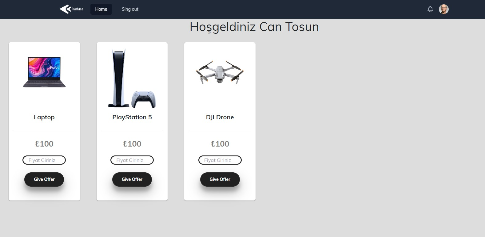

# Kartaca Task App

Temel kullanıcı işlemleri yapılabilen, ana sayfada listenen ürünlere teklif verilebilen bir uygulama geliştirilmiştir. Websocker kullanılarak teklifler anlık olarak oturum açan herkes tarafından görüntülenebilmektedir. API üzerinden kullanıcı işlemleri, ürün ekleme işlemleri ve teklif verme işlemleri yapılabilmektedir.

> Göreve erişim için registrationKey : 6a76f31692209aa7d8a9cd6663adf495e11a3b83c487e62c8f5cfefab4f0aa96
## Backend
- Python - Flask
- Websocket

## Databases
- SQLlite
- Redis

## Frontend
- JavaScript - React


# Gereksinimler
- Docker
- Docker Compose

 # Kurulumlar
 1. Bu depoyu yerel bilgisayarınıza kopyalayın.
 2. docker-compose.yml dosyasını açın.
3. Terminalde aşağıdaki komudu çalıştırın:

```shell
docker-compose up

```

4. Proje http://localhost:3000 portunda çalışacaktır.

# Kullanım
1. Hesap oluşturma

2. Giriş Yapma


3. Ürün listeleme
 

4. Teklif verme

